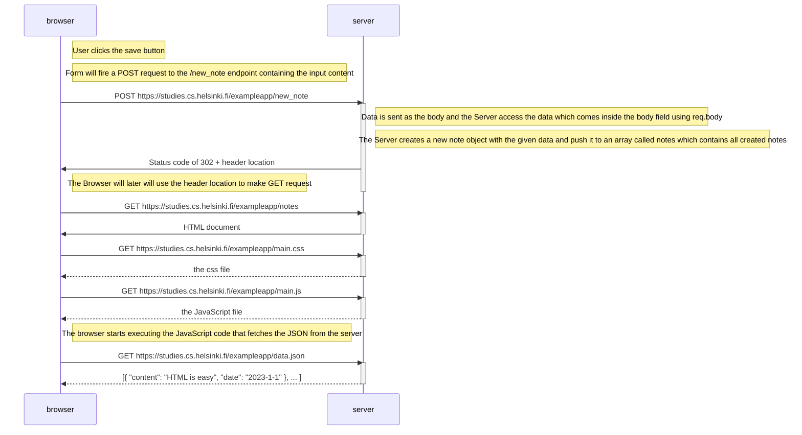

```mermaid
sequenceDiagram
      participant browser
    participant server

	Note right of browser: User clicks the save button
	Note right of browser: Form will fire a POST request to the /new_note endpoint containing the input content
    browser->>server: POST https://studies.cs.helsinki.fi/exampleapp/new_note
    activate server
    Note right of server: Data is sent as the body and the Server access the data which comes inside the body  field using req.body
	Note right of server: The Server creates a new note object with the given data and push it to an array called notes which contains all created notes
    server->>browser: Status code of 302 + header location
    Note right of browser: The Browser will later will use the header location to make GET request
	deactivate server

	browser->>server: GET https://studies.cs.helsinki.fi/exampleapp/notes
	activate server
	server->>browser: HTML document
	deactivate server

browser->>server: GET https://studies.cs.helsinki.fi/exampleapp/main.css
	activate server
    server-->>browser: the css file
    deactivate server

    browser->>server: GET https://studies.cs.helsinki.fi/exampleapp/main.js
    activate server
    server-->>browser: the JavaScript file
    deactivate server

    Note right of browser: The browser starts executing the JavaScript code that fetches the JSON from the server

    browser->>server: GET https://studies.cs.helsinki.fi/exampleapp/data.json
    activate server
    server-->>browser: [{ "content": "HTML is easy", "date": "2023-1-1" }, ... ]
    deactivate server
```
