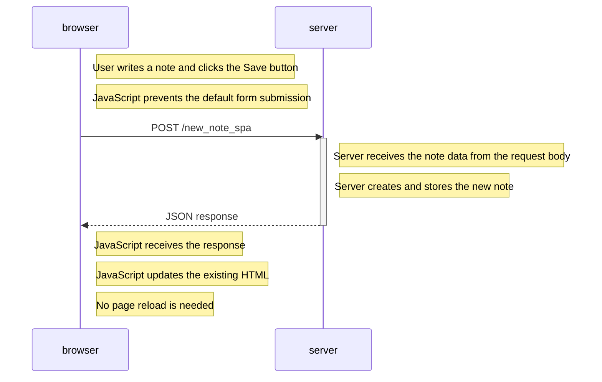

```mermaid
sequenceDiagram
    participant browser
    participant server

    Note right of browser: User writes a note and clicks the Save button
    Note right of browser: JavaScript prevents the default form submission

    browser->>server: POST /new_note_spa
    activate server
    Note right of server: Server receives the note data from the request body
    Note right of server: Server creates and stores the new note
    server-->>browser: JSON response
    deactivate server

    Note right of browser: JavaScript receives the response
    Note right of browser: JavaScript updates the existing HTML
    Note right of browser: No page reload is needed
```
